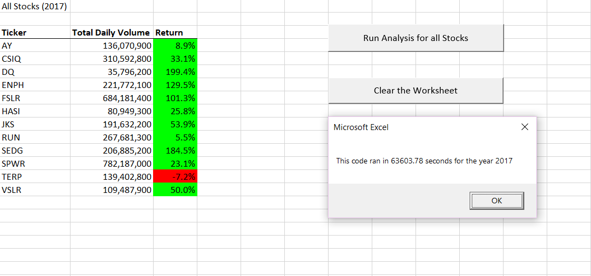
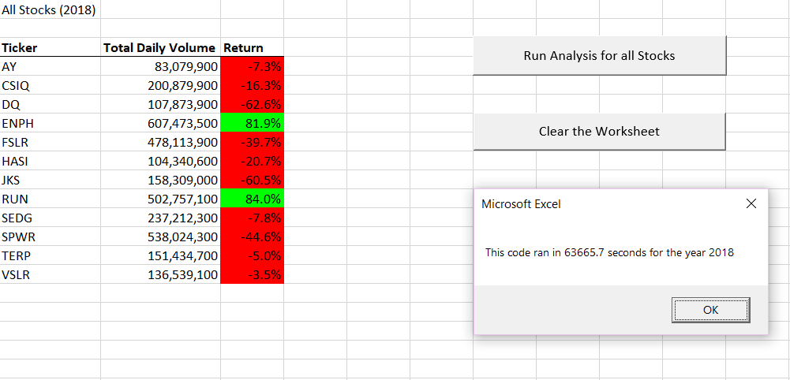

# **Stock-analysis**

## *Overview of Project*

The purpose of this analysis is to help Steve’s parents to know how some stocks were traded in previous years, in order to give them a better understanding of the market when they need to make investments decisions. 

## *Summary*

- What are the advantages or disadvantages of refactoring code?

Thinking about how to answer this question I looked up for the conceptual meaning of refactoring and I found this conceptualization : *“Refactoring is a disciplined technique for restructuring an existing body of code, altering its internal structure without changing its external behavior”1*

Therefore, on one hand the first advantage that I can think of is that it saves time, because instead of having to write a new code from scratch you can use one that is already working correctly and as the definition said, only changing some parts of the internal structure to make it better, but still having the external behavior. In addition to this, you can add that is more efficient since you are making improvements to an existent code, eliminating bugs and reducing the time that the code needs to execute. 

On the other hand, thinking about the possible disadvantages that this may have, refactoring a code that we do not fully understand can be a risky, as new errors can be created while trying to make the changes.

- How do these pros and cons apply to refactoring the original VBA script?

 

By doing this refactoring, improvements to the original code were made, with changes in the internal structure that allowed to have the same result that were expected but in less time.
About the cons, I personally had difficulties to understand what changes were needed and applying those changes without them resulting in an error.

1Fowler, Martin. Refactoring. Martin Fowler. https://refactoring.com/

